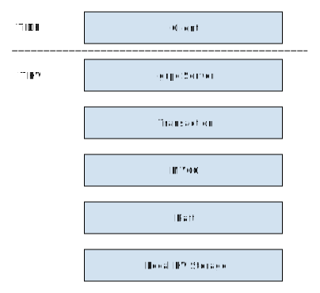

# 事务处理流程

本文将以带事务的请求处理为例，告诉读者一个请求是如何从上到下被 TiKV 处理的。

TiDB-TiKV 组成的系统中，处理请求的模型大致如下所示：



client 端虽然不是 TiKV 的一部分，但对理解一个请求是如何被 TiKV 处理的至关重要。

无论是 TiDB 还是各种语言的client，其发起事务请求的流程都是相似的，此处采用较为容易理解的 [client-rust](https://github.com/TiKV/client-rust) ，对其进行分析。

基本上 TiKV 的事务系统是基于 Google 的 [Percolator](https://research.google/pubs/pub36726/) ，建议你在试图理解 TiKV 的事务模型前先对其有一定了解。

### 开始事务

首先，需要创建一个 client，这个 client 包含了与 pd 组件通信的 `PdRpcClient`。

这部分代码在：`client-rust` 的 `src/transaction/client.rs` 中的 `Client::new`。

使用 `Client::begin` 开始一个事务。

这部分代码在 `src/transaction/client.rs` 中。

```rust, no_run
pub async fn begin(&self) -> Result<Transaction> {
	let timestamp = self.current_timestamp().await?;
	Ok(self.new_transaction(timestamp))
}
```

可以看出就是用现在的时间戳创建了一个新的 `Transaction` 对象。

一路从 `self.current_timestamp` 跟踪下去，你会发现实际上它是向 [`PD::tso` rpc](https://github.com/pingcap/kvproto/blob/d4aeb467de2904c19a20a12de47c25213b759da1/proto/pdpb.proto#L23) 的参数流中放入一个请求，并从输出流收到一个 逻辑时间戳。

进行这个 rpc 调用的代码在 `src/pd/timestamp.rs` 中。

调用的远程函数是 pd 的 `server/grpc_service.go` 中的 `Server.Tso`。

### （单点）读

使用 `Client::get` 来进行读取一个 key  对应的 value。

这部分代码在 `src/transaction/client.rs` 中。

```rust, no_run
pub async fn get(&self, key: impl Into<Key>) -> Result<Option<Value>> {
	let key = key.into();
	self.buffer.get_or_else(key, |key| {
		new_mvcc_get_request(key, self.timestamp).execute(self.rpc.clone())
	}).await
}
```

首先试图从本地缓存中读取（由本事务提交的）内容，否则就 rpc 调用 [`KvGet`](https://github.com/pingcap/kvproto/blob/6650270c39c357d46ba3f24631a44410aff2f2f8/proto/TiKVpb.proto) 来进行读取。

你可能已经知道了，TiKV 将数据分为多个 region，每个 region 的几个副本都放在不同的 TiKV 实例上，通过pd来确定每个 key 在哪里。

这里的代码似乎没有体现“确定数据在哪个 region /哪个 TiKV 实例”的步骤。

但是实际上这部分代码藏在[execute](https://github.com/TiKV/client-rust/blob/b7ced1f44ed9ece4405eee6d2573a6ca6fa46379/src/request.rs#L33)下，你可以发现 `retry_response_stream` 在[这里](https://github.com/TiKV/client-rust/blob/b7ced1f44ed9ece4405eee6d2573a6ca6fa46379/src/request.rs#L52)调用了获取 TiKV 地址的代码。

`GetRegion` 的实现在 pd 的[这里](https://github.com/pingcap/pd/blob/2b56a4c5915cb4b8806629193fd943a2e860ae4f/server/grpc_service.go#L414)。

然后回到 `store_for_key` ，这里会再调用一个 `map_region_to_store` ，最终通过 grpc 调用了 [GetStore](https://github.com/pingcap/kvproto/blob/d4aeb467de2904c19a20a12de47c25213b759da1/proto/pdpb.proto#L31)，将 region 对应的 Store （TiKV 实例，体现为一个 `KVClient`）找到。

`GetStore` 的实现在 pd 的[这里](https://github.com/pingcap/pd/blob/2b56a4c5915cb4b8806629193fd943a2e860ae4f/server/grpc_service.go#L171)。

终于我们拿到了 key 所在的 `KVClient` 了，我们可以用这个 client 向 TiKV 副本请求 key 对应的 value 了。

我们回到 `retry_response_stream`，下一个我们要关心的函数调用是 `store.dispatch` ，这个函数为啥要这样实现我有点看不透，总之它达到的效果就是 grpc 调用 [`KvGet`](https://github.com/pingcap/kvproto/blob/d4aeb467de2904c19a20a12de47c25213b759da1/proto/TiKVpb.proto#L21)。

然后，我们终于到达了 TiKV 仓库， TiKV 中，请求由[ `Server` 结构](https://github.com/TiKV/TiKV/blob/e3058403a0fc9a96870882bf184ac075223b4642/src/server/server.rs#L48) 进行处理，我们要看的 `KvGet` 请求会被打到[这里](https://github.com/TiKV/TiKV/blob/1de029631e09a3f9989a468a9cb4b97ec4db440e/src/server/service/kv.rs#L1155)。

我们可以看到我们首先通过[`Storage::get`函数](https://github.com/TiKV/TiKV/blob/1de029631e09a3f9989a468a9cb4b97ec4db440e/src/storage/mod.rs#L216)来试图读取 `key` 在 `start_ts `下的值。

`get` 函数有一点大，我们将其中的测量部分忽略，可以得到：

```rust, no_run
pub fn get(&self, mut ctx: Context, key: Key,
    start_ts: TimeStamp) -> impl Future<Item = Option<Value>, Error = Error> {
    const CMD: CommandKind = CommandKind::get;
    let priority = ctx.get_priority();
    let priority_tag = get_priority_tag(priority);

    let res = self.read_pool.spawn_handle(
        async move {
            // The bypass_locks set will be checked at most once. `TsSet::vec` is more efficient
            // here.
            let bypass_locks = TsSet::vec_from_u64s(ctx.take_resolved_locks());
            let snapshot = Self::with_tls_engine(|engine| Self::snapshot(engine, &ctx)).await?;
            let snap_store = SnapshotStore::new(snapshot, start_ts,
                        ctx.get_isolation_level(),
                        !ctx.get_not_fill_cache(),
                        bypass_locks,
                        false);
            let result = snap_store.get(&key, &mut statistics)
                    // map storage::txn::Error -> storage::Error
                    .map_err(Error::from);
            result
        },
        priority,
        thread_rng().next_u64(),
    );
    res.map_err(|_| Error::from(ErrorInner::SchedTooBusy))
        .flatten()
}
```

`bypass_locks` 这一块我还是看不透，那么我们先从`snapshot` 开始。这个函数会获取 `Engine`，然后在这个 `Engine` 上得到一个快照，并用这个快照和相关配置设置构造了一个 `SnapshotStore` ，然后在这个 `SnapshotStore` 上调用了 `get`，拿到了最终的数据。

仔细观察 `SnapshotStore::get` 的代码，你会发现它实际上是构造了一个 `PointGetter` ，然后我们再看 `PointGetter` 的 `get` 方法：

```rust, no_run
pub fn get(&mut self, user_key: &Key) -> Result<Option<Value>> {
    if !self.multi {
        // Protect from calling `get()` multiple times when `multi == false`.
        if self.drained {
            return Ok(None);
        } else {
            self.drained = true;
        }
    }

    match self.isolation_level {
        IsolationLevel::Si => {
            // Check for locks that signal concurrent writes in Si.
            self.load_and_check_lock(user_key)?;
        }
        IsolationLevel::Rc => {}
    }

    self.load_data(user_key)
}
```

我们可以看到，当要求 `Si` 的隔离级别的时候，我们需要检查是否有锁，如果检测到了，就会返回 `KeyIsLocked` 错误：

```rust, no_run
fn load_and_check_lock(&mut self, user_key: &Key) -> Result<()> {
    self.statistics.lock.get += 1;
    let lock_value = self.snapshot.get_cf(CF_LOCK, user_key)?;

    if let Some(ref lock_value) = lock_value {
        self.statistics.lock.processed += 1;
        let lock = Lock::parse(lock_value)?;
        if self.met_newer_ts_data == NewerTsCheckState::NotMetYet {
            self.met_newer_ts_data = NewerTsCheckState::Met;
        }
        lock.check_ts_conflict(user_key, self.ts, &self.bypass_locks)
            .map_err(Into::into)
    } else {
        Ok(())
    }
}
```

然后我们调用 `PointGetter` 的 `load_data` 函数来获取版本对应的值。`load_data` 我暂时还没有看透。

接着，我们就将 `GetResponse` 返回到 client。

此时得到的 value 已经上面说的这个 `GetResponse` 里面了，在但 client 仍然会在 `retry_response_stream` 中处理这一回复来解决锁。

#### Resolve locks

首先用 `take_locks`  拿到遇到的锁，然后调用 `resolve_locks` 尝试解决这些锁：

```rust, no_run
pub async fn resolve_locks(
    locks: Vec<kvrpcpb::LockInfo>,
    pd_client: Arc<impl PdClient>,
) -> Result<bool> {
    let ts = pd_client.clone().get_timestamp().await?;
    let mut has_live_locks = false;
    let expired_locks = locks.into_iter().filter(|lock| {
        let expired = ts.physical - Timestamp::from_version(lock.lock_version).physical
            >= lock.lock_ttl as i64;
        if !expired {
            has_live_locks = true;
        }
        expired
    });

    // records the commit version of each primary lock (representing the status of the transaction)
    let mut commit_versions: HashMap<u64, u64> = HashMap::new();
    let mut clean_regions: HashMap<u64, HashSet<RegionVerId>> = HashMap::new();
    for lock in expired_locks {
        let primary_key: Key = lock.primary_lock.into();
        let region_ver_id = pd_client.region_for_key(&primary_key).await?.ver_id();
        // skip if the region is cleaned
        if clean_regions
            .get(&lock.lock_version)
            .map(|regions| regions.contains(&region_ver_id))
            .unwrap_or(false)
        {
            continue;
        }

        let commit_version = match commit_versions.get(&lock.lock_version) {
            Some(&commit_version) => commit_version,
            None => {
                let commit_version = requests::new_cleanup_request(primary_key, lock.lock_version)
                    .execute(pd_client.clone())
                    .await?;
                commit_versions.insert(lock.lock_version, commit_version);
                commit_version
            }
        };

        let cleaned_region = resolve_lock_with_retry(
            lock.key.into(),
            lock.lock_version,
            commit_version,
            pd_client.clone(),
        )
        .await?;
        clean_regions
            .entry(lock.lock_version)
            .or_insert_with(HashSet::new)
            .insert(cleaned_region);
    }
    Ok(!has_live_locks)
}
```

可见是先筛选出已经超过其持有期限的锁，然后逐个解决。

然后就会获取 `lock_version` 对应的 `commit_version` （可能被缓存过），并用来发起 `cleanup_request`。

`Cleanup` 这东西据说4.0之后已经不用了，那我就不管了吧。

然后就是重点：`resolve_lock_with_retry`，这个函数实际构造一个 `ResolveLockRequest`， 并发送给 TiKV 执行。

我们转到 TiKV 的代码，你会发现这个请求先是被转换为 `TypedCommand`， 然后被 `sched_txn_command` 执行。

根据 `Request` 上的 `key` 是否为空，会将 `ResolveLockRequest` 转换为 `ResolveLock` 或 `ResolveLockLite`。它们之间区别是 `ResolveLockLite` 只会尝试解决 `Request` 要求解决的那些锁，而 `ResolveLock` 似乎解决了整个 region 上的锁。

 `ResolveLock` 这个command实际执行的位置比较难找，我找了好久终于发现它有两段，一段在[这里](https://github.com/TiKV/TiKV/blob/82d180d120e115e69512ea7f944e93e6dc5022a0/src/storage/txn/process.rs#L416)，负责读，还有一段在[这里](https://github.com/TiKV/TiKV/blob/82d180d120e115e69512ea7f944e93e6dc5022a0/src/storage/txn/process.rs#L775)，负责写，不过[注释](https://github.com/TiKV/TiKV/blob/82d180d120e115e69512ea7f944e93e6dc5022a0/src/storage/txn/commands.rs#L520)已经解释了 `ResolveLock` 会做些什么。

这两段依赖了 `MvccTxn` 和 `MvccReader`，本次限于篇幅不在展开，将在另外的文章中讲解。

然后就可以返回到 client-rust 的 `resolve_locks` 函数，并继续下去，直到所有的 `expired_locks` 都被解决完了。

然后就可以返回最终的 `Get` 结果了。（终于啊……）

我们用一张数据流图总结这个过程：


